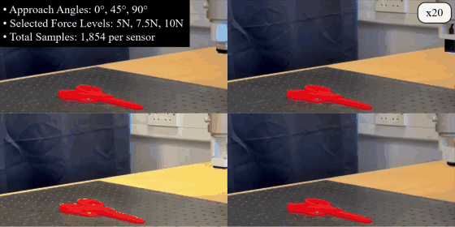
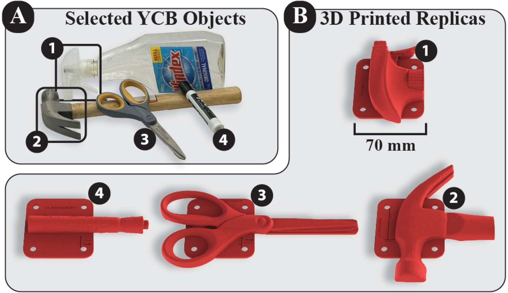
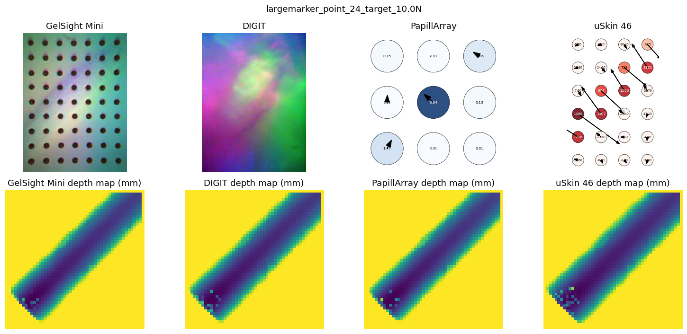
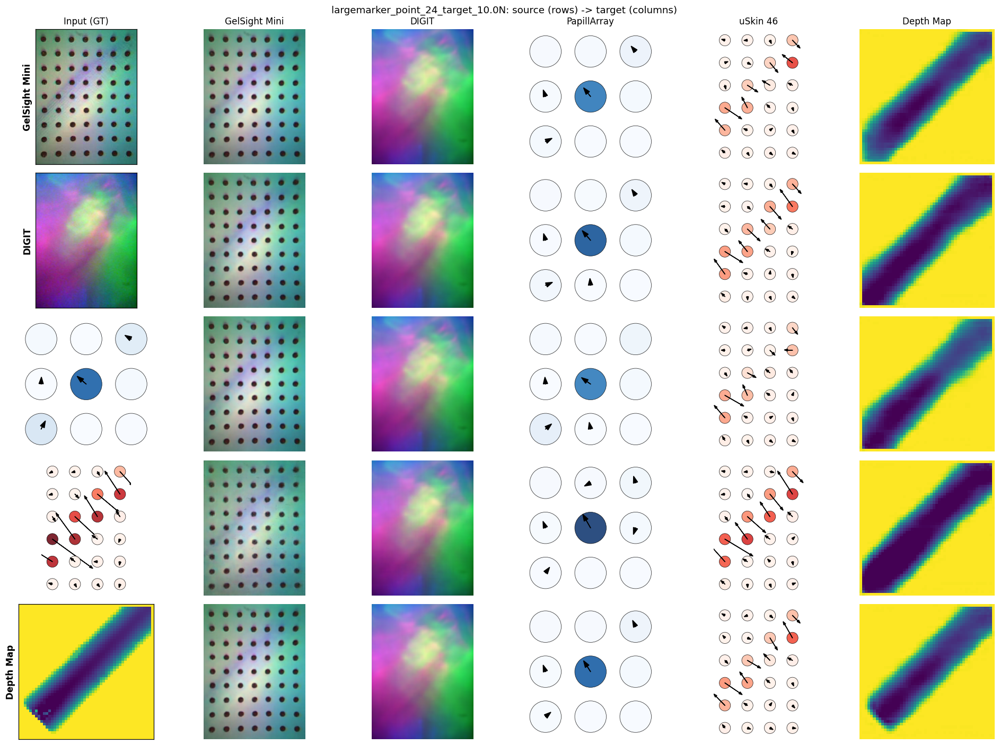

# UniTac-VAE multi-sensor tactile dataset

Paired recordings from **four commercial tactile sensors** (GelSight Mini, DIGIT, Contactile PapillArray, XELA uSkin uSPa 46) pressed on **3D-printed replicas of four YCB objects**, each sample paired with a **contact depth map** computed from the object mesh and the recorded end-effector pose. Released with the paper


> **UniTac-VAE: A Depth-Aligned Latent Space for Sensor-Agnostic Tactile Representation**
> Jian Hou and Adam J. Spiers, *IEEE Robotics and Automation Letters*, vol. 11, no. 10, 2026.
> [doi:10.1109/LRA.2026.3726336](https://doi.org/10.1109/LRA.2026.3726336)


https://github.com/user-attachments/assets/d0407985-e56f-450e-b43e-e52ccd2dfb18


This repository documents the dataset and visualisation tool: the reference UniTac-VAE models and a script that translates any sample between the four sensors and the depth map, so you can see what the data looks like across modalities.


<p align="center"></p>

*Data collection (20x): each sensor is mounted in turn on a UR5e and pressed normally onto the replicas at a grid of contact points.*

## Download

**Download from [Google Drive](https://drive.google.com/drive/folders/10IRGayiLZmHYRAA8ZGqHyJFqVDhON-wr?usp=sharing).**


| Part | Size | Contents |
|---|---|---|
| `paired/` | 648 MB | 1,854 contact interactions x 4 sensors, one HDF5 file per object, each sample with its own 50 x 50 contact depth map (mm) |
| `synthetic/` | 26 MB | 8,000 procedurally rendered contact depth maps (2,000 per object) |
| `cad/` | 104 MB | the four object meshes (STL, mm) and per-contact-point local point clouds |
| `README.md`, `manifest.json` | | field-by-field schema, counts, SHA-256 of every file |


## What is in the dataset

### Sensors

| key | Sensor | Mechanism | Sensing area (mm) | Native signal |
|---|---|---|---|---|
| `gelsight` | GelSight Mini | vision (marker elastomer) | 18.6 x 14.3 | RGB image 3 x 320 x 240 |
| `digit` | DIGIT | vision (curved silicone) | 19.0 x 16.0 | RGB image 3 x 320 x 240 |
| `papill` | Contactile PapillArray | taxel (optical), 9 domes | 24.0 x 24.0 | pillar forces 9 x (fx, fy, fz) in N |
| `xela` | XELA uSkin uSPa 46 | taxel (magnetic), 24 taxels | 30.0 x 40.0 | raw taxel readings 24 x (x, y, z), baseline-subtracted counts |

The four sensors were mounted one at a time on a UR5e with a calibrated adapter so that their tool centre points coincide. Every contact point was therefore pressed by all four sensors.

### Objects

<p align="center"></p>

*(1) Windex bottle, (2) hammer, (3) scissors, (4) large marker. (A) the YCB objects, (B) the 3D-printed replicas with mounting plates that were pressed on. The STL files are in `cad/`.*

| key | Object (YCB replica) | contact points | paired samples (x3 force levels) |
|---|---|---|---|
| `windex` | Windex bottle (partial print) | 135 | 405 |
| `hammer` | Hammer (partial print) | 174 | 522 |
| `scissor` | Scissors | 198 | 594 |
| `largemarker` | Large marker | 111 | 333 |
| | **total** | **618** | **1,854** |

Each contact point was pressed vertically (2 mm/s, stopped at 10 N) at three approach orientations (0, 45, 90 deg about the vertical axis). From each force ramp the time step closest to 5 N, 7.5 N and 10 N (within 1.5 N, per sensor) was extracted.

## Data format

The field-by-field schema (HDF5 layout, units, coordinate frames) is documented in the dataset's own `README.md`, distributed with the data on Google Drive. `paired/index.csv` lists all 1,854 sample ids.

## Visualising samples with the reference models

The repository includes the UniTac-VAE reference models (`weights/`: one depth-map VAE, four sensor-specific VAEs and their normalisation statistics). This uses the bundled example `examples/largemarker_point_24_target_10.0N.npz` (one press of the large marker at 10 N recorded by all four sensors), so it works before the dataset is downloaded.

`demo_sample.png` shows the raw sample: native signals on top, each sensor's own contact depth map (mm) below.

<p align="center"></p>

`demo.png` is the cross-modal grid: each row takes the ground-truth signal of one modality (left column) and decodes it into every modality (remaining columns). The diagonal is self-reconstruction; the last column is depth estimation.

<p align="center"></p>

To do the same for any sample of the downloaded dataset:

```bash
python scripts/cross_modal_demo.py --data-root unitac-vae-dataset --sample-id hammer_point_82_target_10.0N --out hammer.png --also-plot-sample
```

Sample ids follow `<object>_point_<NN>_target_<force>N`; `paired/index.csv` lists them all.

## Repository layout

```
examples/                     bundled sample, the figures above, data-collection GIF
weights/                      reference model weights and normalisation statistics
scripts/cross_modal_demo.py   visualisation script
unitac_vae/                   dataset loader, model definitions, plotting helpers
requirements.txt              torch, numpy, pandas, h5py, matplotlib
```

## License

The code and the reference models in this repository are released under the [MIT License](LICENSE).

## Citation

```bibtex
@article{hou2026unitacvae,
  title   = {UniTac-VAE: A Depth-Aligned Latent Space for Sensor-Agnostic Tactile Representation},
  author  = {Hou, Jian and Spiers, Adam J.},
  journal = {IEEE Robotics and Automation Letters},
  volume  = {11},
  number  = {10},
  year    = {2026},
  doi     = {10.1109/LRA.2026.3726336}
}
```
